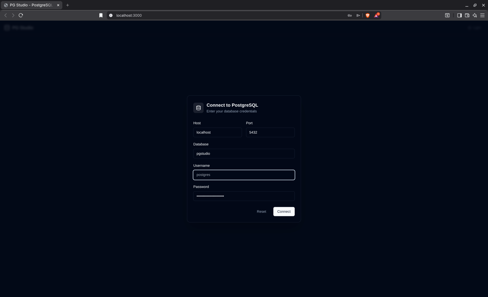
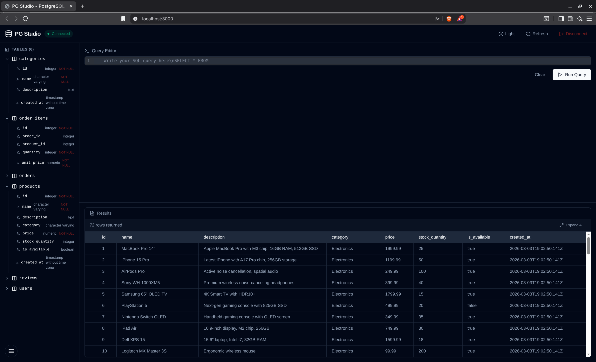
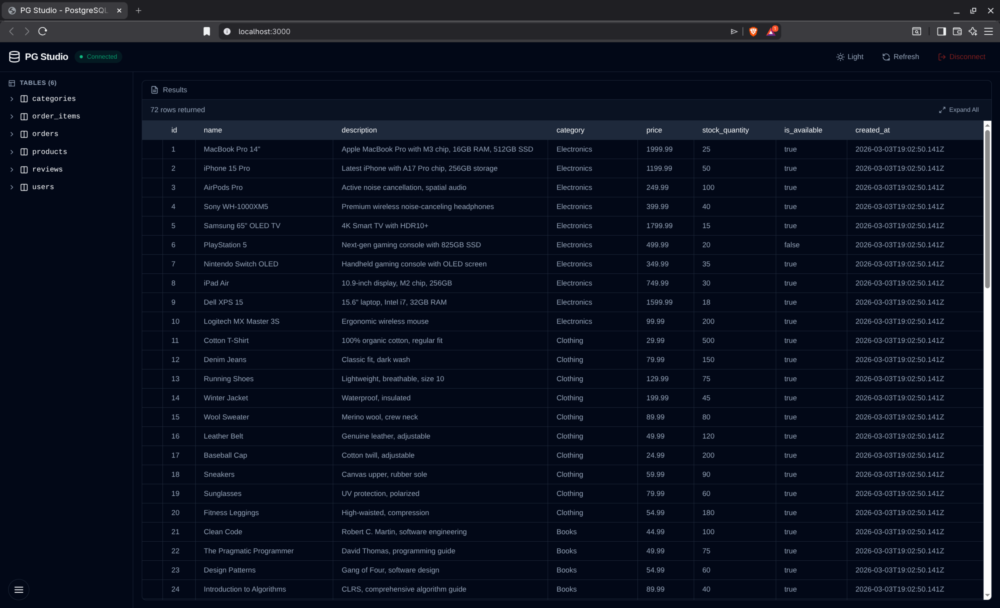
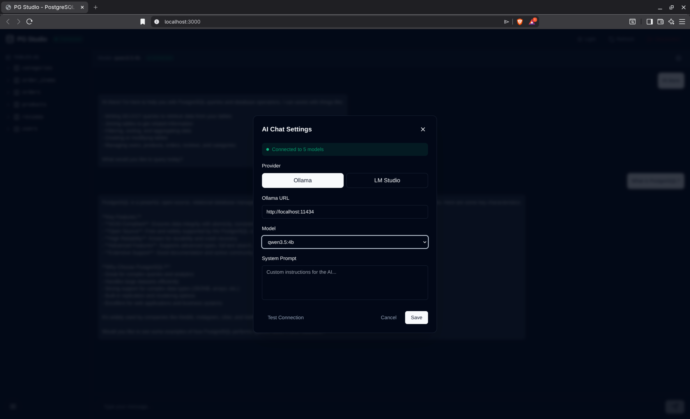
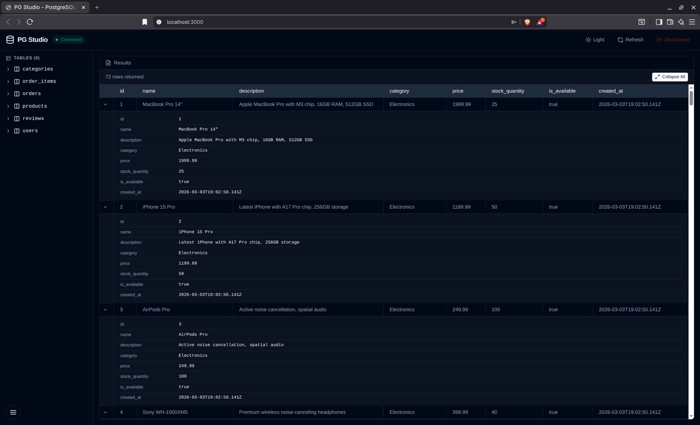
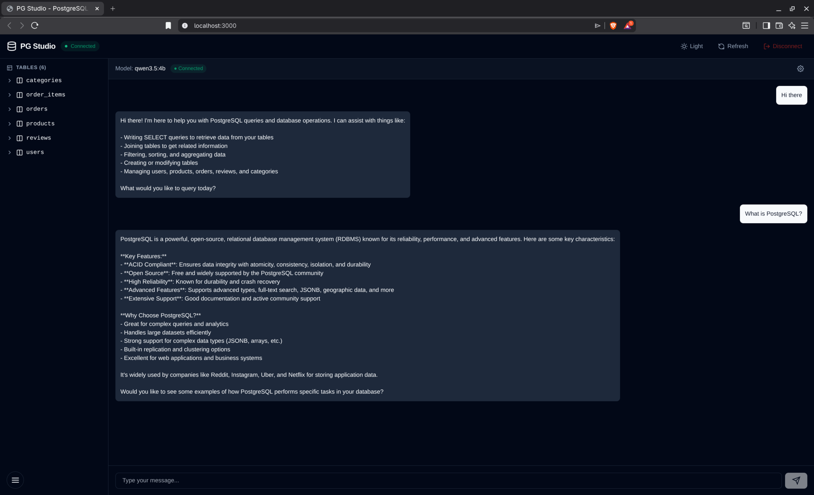

# PG Studio - PostgreSQL Client with AI Assistance

A modern, browser-based PostgreSQL client inspired by Drizzle ORM Studio. Features include a SQL query editor with syntax highlighting, results table with expand/collapse functionality, schema browser, and integrated AI chat powered by local LLMs (Ollama/LM Studio).



## Features

- **SQL Query Editor** - CodeMirror-based editor with SQL syntax highlighting
- **Results Table** - Interactive table with expand/collapse for JSON/array fields
- **Schema Browser** - View all tables and their columns in the sidebar
- **AI Chat** - Ask questions in plain English and get SQL queries generated
- **Dark Mode** - Default dark theme for sensitive eyes
- **Local LLM Support** - Connect to Ollama or LM Studio for AI assistance
- **WebSocket Proxy** - Secure communication between browser and database

## Main Dashboard Views

### Full View (Editor + Results + Schema)



### Results Only View



### Connection Modal



## Architecture

```
┌─────────────────────────────────────────────────────────────────┐
│                        Browser (Port 3000)                      │
│  ┌──────────────┐  ┌──────────────┐  ┌───────────────────────┐  │
│  │  Next.js UI  │  │  Query Editor│  │    AI Chat Window    │  │
│  └──────┬───────┘  └──────┬───────┘  └──────────┬────────────┘  │
│         │                  │                      │               │
│         └──────────────────┼──────────────────────┘               │
│                            │                                      │
│                   ┌────────▼────────┐                           │
│                   │  WebSocket/HTTP │                           │
│                   │  (Port 3001)    │                           │
│                   └────────┬────────┘                           │
└────────────────────────────┼────────────────────────────────────┘
                             │
              ┌──────────────┴──────────────┐
              │                              │
     ┌────────▼────────┐          ┌─────────▼─────────┐
     │ PostgreSQL      │          │ Ollama / LM Studio │
     │ (Port 5432)    │          │ (Port 11434/1234)  │
     └─────────────────┘          └───────────────────┘
```

## Prerequisites

- **Node.js** 18.x or higher
- **PostgreSQL** 12 or higher (local or remote)
- **Ollama** or **LM Studio** (optional, for AI features)

### Installing Ollama

```bash
# macOS
brew install ollama

# Linux
curl -fsSL https://ollama.com/install.sh | sh

# Windows
# Download from https://ollama.com/download/windows
```

Start Ollama and pull a model:
```bash
ollama serve
ollama pull qwen3.5:4b
```

## Quick Start

### 1. Clone and Install

```bash
cd pg-studio
npm install
```

### 2. Start PostgreSQL

Using Docker:
```bash
docker-compose up -d
```

This starts PostgreSQL on port 5432 with:
- Database: `pgstudio`
- User: `keycloak`
- Password: `change_me_in_local_env`

### 3. Start the Backend Proxy Server

```bash
node backend/proxy.js
```

Or use the convenience script:
```bash
./start.sh
```

The backend runs on **port 3001** and handles:
- WebSocket connections for real-time query execution
- HTTP API for LLM chat
- Database connection management

### 4. Start the Frontend

```bash
npm run dev
```

The application runs on **http://localhost:3000**

### 5. Use the Application



1. Open http://localhost:3000
2. Enter your PostgreSQL credentials in the connection modal
3. Click Connect
4. Write SQL queries in the editor or use the AI Chat

## Managing Services

PG Studio provides convenient scripts to manage the application:

### Start/Stop Commands

```bash
# Start both backend and frontend
./start.sh

# Stop all services
./stop.sh

# Or use npm scripts:
npm run stop      # Stop frontend only
npm run stop:all  # Stop all Node processes
npm run restart   # Restart everything
```

### Quick Reference

| Command | Description |
|---------|-------------|
| `./start.sh` | Start both backend + frontend |
| `./stop.sh` | Stop both services |
| `npm run dev` | Start frontend only |
| `npm run stop` | Stop frontend |
| `npm run restart` | Restart frontend |

### Viewing Logs

Logs are saved to `/tmp/`:
```bash
# Backend logs
tail -f /tmp/pgstudio-backend.log

# Frontend logs
tail -f /tmp/pgstudio-frontend.log
```

## Configuration

### Environment Variables

Create a `.env.local` file (optional):

```env
# PostgreSQL (default values)
POSTGRES_HOST=localhost
POSTGRES_PORT=5432
POSTGRES_DB=pgstudio
POSTGRES_USER=keycloak
POSTGRES_PASSWORD=change_me_in_local_env

# Ollama (default values)
OLLAMA_URL=http://localhost:11434
LMSTUDIO_URL=http://localhost:1234
```

### Ollama Configuration

In the AI Chat settings:
1. Click the gear icon in the chat header
2. Select provider (Ollama or LM Studio)
3. Choose a model from the available list
4. Optionally customize the system prompt

## AI Chat

PG Studio integrates with local LLMs to help you write SQL queries using natural language.

### AI Chat Interface



### AI Settings Modal


To use AI Chat:
1. Click the floating menu button (bottom-left)
2. Select **Open AI Chat**
3. Click the gear icon to configure your LLM provider
4. Select a model (e.g., qwen3.5:4b)
5. Ask questions like "Show me all users" or "How many orders do we have?"

## Project Structure

```
pg-studio/
├── app/                    # Next.js app directory
│   ├── page.tsx            # Main application page
│   ├── layout.tsx          # Root layout
│   └── globals.css         # Global styles (dark mode)
├── components/
│   ├── Editor.tsx          # SQL code editor (CodeMirror)
│   ├── ResultsTable.tsx    # Query results display
│   ├── SchemaBrowser.tsx   # Database schema sidebar
│   ├── ChatWindow.tsx      # AI chat interface
│   └── ChatSettings.tsx    # LLM configuration modal
├── lib/
│   ├── db.ts               # Database client & queries
│   └── llm.ts              # LLM API utilities
├── backend/
│   └── proxy.js            # WebSocket + HTTP proxy server
├── init.sql                # Seed data for PostgreSQL
├── docker-compose.yml      # PostgreSQL container config
└── package.json            # Node.js dependencies
```

## API Endpoints

The backend proxy exposes these HTTP endpoints on port 3001:

| Endpoint | Method | Description |
|----------|--------|-------------|
| `/api/llm-config` | GET/POST | Get/set LLM configuration |
| `/api/llm-health` | GET | Check Ollama/LM Studio connection |
| `/api/models` | GET | List available LLM models |
| `/api/chat` | POST | Non-streaming chat |
| `/api/chat/stream` | POST | Streaming chat (SSE) |
| `/api/schema` | GET | Get database schema |

## Troubleshooting

### Port Already in Use

If you get `EADDRINUSE: address already in use`:

```bash
# Find process using the port
lsof -i :3000
lsof -i :3001

# Kill the process
kill -9 <PID>
```

### Database Connection Failed

1. Ensure PostgreSQL is running:
   ```bash
   docker-compose ps
   ```

2. Check credentials in the connection modal
3. Verify PostgreSQL accepts connections:
   ```bash
   psql -h localhost -U keycloak -d pgstudio
   ```

### Ollama Not Connecting

1. Ensure Ollama is running:
   ```bash
   ollama serve
   ```

2. Check if models are installed:
   ```bash
   ollama list
   ```

3. Verify connection:
   ```bash
   curl http://localhost:11434/api/tags
   ```

### Frontend Build Errors

If you encounter build errors:

```bash
# Clean and reinstall
rm -rf node_modules .next
npm install
npm run dev
```

## Development

### Running in Development Mode

```bash
# Terminal 1: Start backend
node backend/proxy.js

# Terminal 2: Start frontend
npm run dev
```

### Building for Production

```bash
npm run build
npm start
```

## License

MIT License - feel free to use this project for learning or commercial purposes.

## Acknowledgments

- [Drizzle ORM](https://orm.drizzle.team/) - For the inspiration
- [CodeMirror](https://codemirror.net/) - SQL editor
- [Ollama](https://ollama.ai/) - Local LLM runtime
- [Next.js](https://nextjs.org/) - React framework
